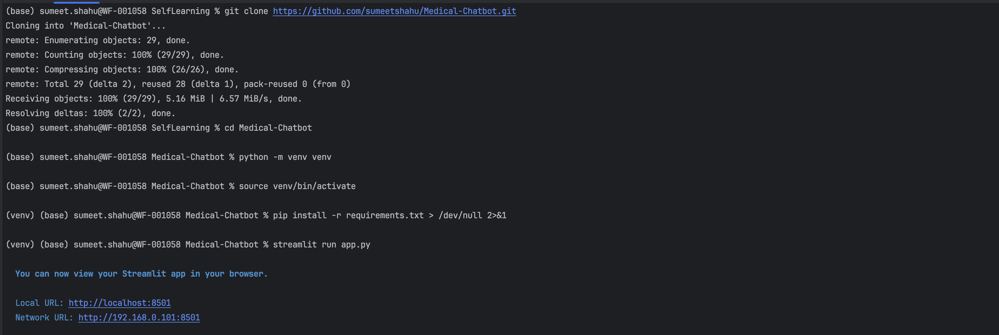

# Medical Chatbot 🏥🤖

A Python-based medical chatbot application built with Streamlit and powered by OpenAI's GPT-4. This intelligent assistant helps users understand medical reports, provides health information, and answers medical-related questions while maintaining privacy and security standards.

## ⚠️ Important Disclaimer

**This application is for informational purposes only and should not be used as a substitute for professional medical advice, diagnosis, or treatment. Always consult with qualified healthcare professionals for medical concerns.**

## ✨ Features

- 💬 Interactive chat interface powered by GPT-4
- 🔒 Privacy and security-focused design
- 📊 Lab result interpretation
- 🎯 Context-aware medical responses
- 🌐 Web-based interface using Streamlit

## 📋 Prerequisites

Before running the application, ensure you have:

- **Python 3.11** installed on your system
- **OpenAI API Key** >> Refer: https://platform.openai.com/api-keys
- Basic familiarity with command line/terminal

## 🚀 Quick Start

### 1. Clone the Repository

```bash
git clone https://github.com/sumeetshahu/Medical-Chatbot.git
cd Medical-Chatbot
```

### 2. Set Up Python Environment

It's recommended to use a virtual environment:

```bash
# Create virtual environment
python -m venv venv

# Activate virtual environment
# On Windows:
venv\Scripts\activate
# On macOS/Linux:
source venv/bin/activate
```

### 3. Install Dependencies

```bash
pip install -r requirements.txt
```

### 4. Change Configurations (Optional)

- Go to config/settings.py
- Change OpenAI model parameters
- Modify mock lab test reports and ranges
- Please note this step is not necessary to run the streamlit application


### 5. Run the Application

```bash
streamlit run app.py
```

The application will start and automatically open in your default web browser at `http://localhost:8501`.

## 📁 Project Structure

```
medical_chatbot/
├── app.py                    # Main Streamlit application entry point
├── config/
│   ├── __init__.py
│   └── settings.py           # Application configuration settings
├── models/
│   ├── __init__.py
│   ├── lab_result.py         # Data models for lab results
│   └── enums.py              # Enumerations and constants
├── services/
│   ├── __init__.py
│   ├── parser.py             # Medical report parsing logic
│   ├── security.py           # Security and privacy management
│   └── chatbot.py            # Core chatbot service with GPT-4 integration
├── utils/
│   ├── __init__.py
│   └── helpers.py            # Utility functions and helpers
└── requirements.txt          # Python dependencies
```

## 🖥️ Command Line Setup

For a visual guide on setting up the application via command line, refer to the screenshot below:



This image shows the complete setup process including environment activation, dependency installation, and application launch.


### Example Use Cases

- "Can you explain my blood test results?"
- "What does this medical term mean?"
- "Help me understand my lab report"
- "What are the normal ranges for these values?"

## 🔒 Privacy & Security

This application prioritizes user privacy and data security:

- No medical data is stored permanently
- No API key saved anywhere
- Conversations are not logged or saved
- Local processing where possible
- HIPAA-conscious design principles


### Performance Tips

- Ensure stable internet connection for API calls
- Use Python 3.11 for optimal performance
- Close other resource-intensive applications
- Consider upgrading your OpenAI plan for faster responses
